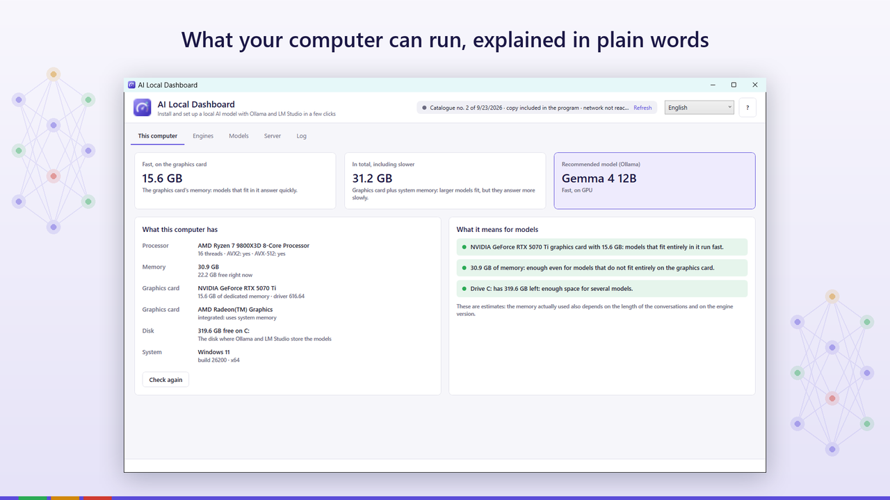
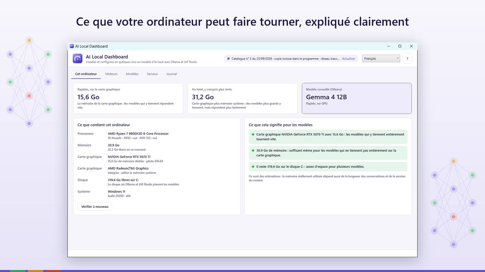
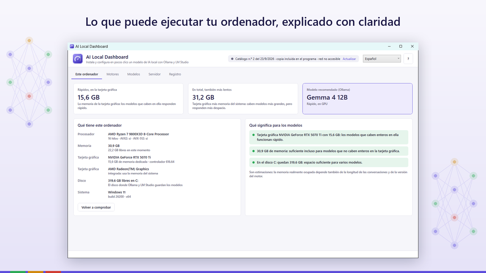
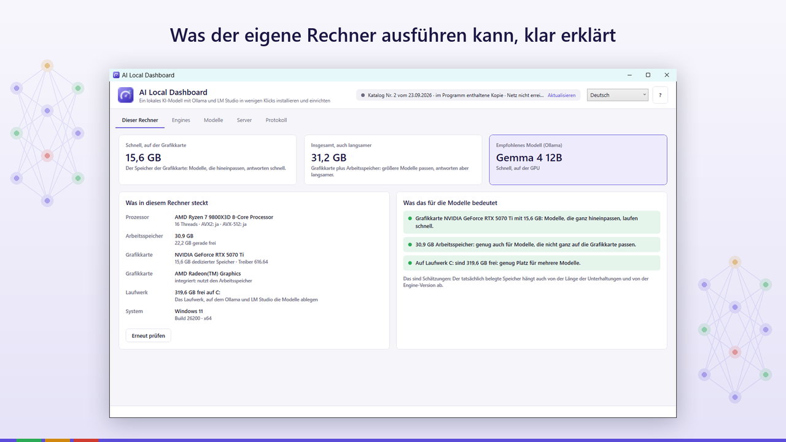
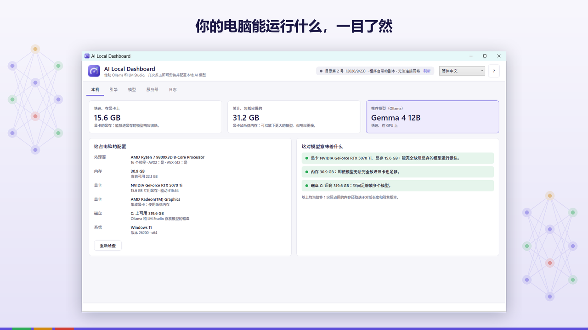

# AI Local Dashboard

<a href="#it">Italiano</a> ·
<a href="#en">English</a> ·
<a href="#fr">Français</a> ·
<a href="#es">Español</a> ·
<a href="#de">Deutsch</a> ·
<a href="#zh">中文</a>

---

<h2 id="it">Italiano</h2>

Un modello di intelligenza artificiale sul tuo computer, in pochi clic:
controlla i requisiti, installa Ollama o LM Studio, scarica il modello giusto e avvia il server
locale.

Gli strumenti per far girare un'intelligenza artificiale sul proprio computer ci sono, e sono
gratuiti: Ollama e LM Studio. Ma prima bisogna capire quale modello regge la propria scheda video,
scaricare l'installer giusto, sceglierne uno fra centinaia e configurare il server. AI Local
Dashboard fa tutto questo da un pannello solo.

Mostra che cosa c'è nel computer e che cosa significa: quanti gigabyte di modello girano veloci
nella scheda video e quanti, più lentamente, con la memoria di sistema. Installa e aggiorna Ollama e
LM Studio dai siti ufficiali, per il tuo utente, senza privilegi di amministratore. Propone il
modello adatto, lo scarica, avvia il server locale compatibile OpenAI e ti dà gli indirizzi da
copiare nei tuoi programmi, con una prova immediata.

Interfaccia e guida in sei lingue. Gratuito, nessun account, nessuna telemetria.

Ogni installer parte solo se è identico a quello indicato nel catalogo
firmato digitalmente e porta la firma del suo editore. Le domande che fai al modello restano sul tuo
computer, e al Titolare non arriva niente.

**Aggiornamenti e sicurezza.** Gli aggiornamenti di sicurezza sono garantiti per cinque anni dalla
data in cui una versione è stata immessa sul mercato. Chi individua una vulnerabilità può scriverne
a <vis-k@outlook.it>: riceve conferma della segnalazione e viene tenuto informato. Chi segnala in
buona fede, senza divulgare il problema prima che sia corretto, non ha niente da temere.

Ollama e LM Studio sono prodotti di terzi con le proprie licenze; AI Local Dashboard non è affiliato
ai loro autori.

<a href="https://apps.microsoft.com/detail/9NR5SCS8T4B8">Microsoft Store</a>
· <a href="privacy.html#it">Privacy</a>
· <a href="eula.html#it">Contratto</a>

---

<h2 id="en">English</h2>

An artificial intelligence model on your own computer, in a few clicks: check
the requirements, install Ollama or LM Studio, download the right model and start the local
server.

The tools for running an artificial intelligence on your own computer exist, and they are free:
Ollama and LM Studio. But first you have to work out which model your graphics card can handle,
download the right installer, pick one out of hundreds and set up the server. AI Local Dashboard
does all of this from a single panel.

It shows what is in your computer and what it means: how many gigabytes of model run fast on the
graphics card and how many, more slowly, with system memory. It installs and updates Ollama and LM
Studio from their official websites, for your user, without administrator rights. It suggests the
right model, downloads it, starts the OpenAI-compatible local server and gives you the addresses to
copy into your programs, with an instant test.

Interface and help in six languages. Free, no account, no telemetry.

Every installer runs only if it is identical to the one listed in the
digitally signed catalogue and carries its publisher's signature. The questions you ask the model
stay on your computer, and nothing reaches the Owner.

**Updates and security.** Security updates are provided for five years from the date a version was
placed on the market. Anyone who finds a vulnerability can write to <vis-k@outlook.it>: they get an
acknowledgement and are kept informed. Anyone reporting in good faith, without disclosing the
problem before it is fixed, has nothing to fear.

Ollama and LM Studio are third-party products with their own licences; AI Local Dashboard is not
affiliated with their authors.

<a href="https://apps.microsoft.com/detail/9NR5SCS8T4B8">Microsoft Store</a>
· <a href="privacy.html#en">Privacy</a>
· <a href="eula.html#en">Licence</a>

---

<h2 id="fr">Français</h2>

Un modèle d'intelligence artificielle sur votre ordinateur, en quelques clics :
vérifiez les prérequis, installez Ollama ou LM Studio, téléchargez le bon modèle et démarrez le
serveur local.

Les outils pour faire tourner une intelligence artificielle sur son ordinateur existent, et ils sont
gratuits : Ollama et LM Studio. Mais il faut d'abord comprendre quel modèle sa carte graphique peut
supporter, télécharger le bon programme d'installation, en choisir un parmi des centaines et
configurer le serveur. AI Local Dashboard fait tout cela depuis un seul panneau.

Il montre ce que contient l'ordinateur et ce que cela signifie : combien de gigaoctets de modèle
tournent vite sur la carte graphique et combien, plus lentement, avec la mémoire système. Il installe
et met à jour Ollama et LM Studio depuis leurs sites officiels, pour votre utilisateur, sans droits
d'administrateur. Il propose le modèle adapté, le télécharge, démarre le serveur local compatible
OpenAI et vous donne les adresses à copier dans vos programmes, avec un essai immédiat.

Interface et aide en six langues. Gratuit, sans compte, sans télémétrie.

Chaque programme d'installation ne démarre que s'il est identique à celui
indiqué dans le catalogue signé numériquement et porte la signature de son éditeur. Les questions
posées au modèle restent sur votre ordinateur, et rien ne parvient au Titulaire.

**Mises à jour et sécurité.** Les mises à jour de sécurité sont assurées pendant cinq ans à compter
de la date de mise sur le marché d'une version. Qui découvre une vulnérabilité peut écrire à
<vis-k@outlook.it> : un accusé de réception est envoyé et la personne est tenue informée. Qui
signale de bonne foi, sans divulguer le problème avant sa correction, n'a rien à craindre.

Ollama et LM Studio sont des produits tiers avec leurs propres licences ; AI Local Dashboard n'est
pas affilié à leurs auteurs.

<a href="https://apps.microsoft.com/detail/9NR5SCS8T4B8">Microsoft Store</a>
· <a href="privacy.html#fr">Privacy</a>
· <a href="eula.html#fr">Contrat</a>

---

<h2 id="es">Español</h2>

Un modelo de inteligencia artificial en tu ordenador, en pocos clics: comprueba
los requisitos, instala Ollama o LM Studio, descarga el modelo adecuado e inicia el servidor
local.

Las herramientas para ejecutar una inteligencia artificial en tu propio ordenador existen, y son
gratuitas: Ollama y LM Studio. Pero antes hay que saber qué modelo aguanta tu tarjeta gráfica,
descargar el instalador correcto, elegir uno entre cientos y configurar el servidor. AI Local
Dashboard hace todo esto desde un solo panel.

Muestra qué hay en el ordenador y qué significa: cuántos gigabytes de modelo funcionan rápido en la
tarjeta gráfica y cuántos, más despacio, con la memoria del sistema. Instala y actualiza Ollama y LM
Studio desde sus sitios oficiales, para tu usuario, sin permisos de administrador. Propone el modelo
adecuado, lo descarga, inicia el servidor local compatible con OpenAI y te da las direcciones para
copiar en tus programas, con una prueba inmediata.

Interfaz y ayuda en seis idiomas. Gratis, sin cuenta, sin telemetría.

Cada instalador solo se inicia si es idéntico al indicado en el catálogo
firmado digitalmente y lleva la firma de su editor. Las preguntas que haces al modelo se quedan en
tu ordenador, y al Titular no le llega nada.

**Actualizaciones y seguridad.** Las actualizaciones de seguridad están garantizadas durante cinco
años desde la fecha en que una versión se introdujo en el mercado. Quien detecte una vulnerabilidad
puede escribir a <vis-k@outlook.it>: recibe confirmación y se le mantiene al tanto. Quien informa de
buena fe, sin divulgar el problema antes de que esté corregido, no tiene nada que temer.

Ollama y LM Studio son productos de terceros con sus propias licencias; AI Local Dashboard no está
afiliado a sus autores.

<a href="https://apps.microsoft.com/detail/9NR5SCS8T4B8">Microsoft Store</a>
· <a href="privacy.html#es">Privacy</a>
· <a href="eula.html#es">Contrato</a>

---

<h2 id="de">Deutsch</h2>

Ein KI-Modell auf dem eigenen Rechner, in wenigen Klicks: Voraussetzungen
prüfen, Ollama oder LM Studio installieren, das passende Modell herunterladen und den lokalen Server
starten.

Die Werkzeuge, um eine künstliche Intelligenz auf dem eigenen Rechner laufen zu lassen, gibt es, und
sie sind kostenlos: Ollama und LM Studio. Doch zuerst muss man verstehen, welches Modell die eigene
Grafikkarte verkraftet, das richtige Installationsprogramm herunterladen, aus Hunderten eines
wählen und den Server einrichten. AI Local Dashboard erledigt all das in einem einzigen Fenster.

Es zeigt, was im Rechner steckt und was das bedeutet: wie viele Gigabyte Modell schnell auf der
Grafikkarte laufen und wie viele, langsamer, mit dem Arbeitsspeicher. Es installiert und
aktualisiert Ollama und LM Studio von den offiziellen Websites, für den eigenen Benutzer, ohne
Administratorrechte. Es schlägt das passende Modell vor, lädt es herunter, startet den
OpenAI-kompatiblen lokalen Server und liefert die Adressen für die eigenen Programme, mit einem
sofortigen Test.

Oberfläche und Hilfe in sechs Sprachen. Kostenlos, kein Konto, keine Telemetrie.

Jedes Installationsprogramm startet nur, wenn es mit dem im digital
signierten Katalog angegebenen identisch ist und die Signatur seines Herstellers trägt. Die Fragen
an das Modell bleiben auf dem eigenen Rechner, und beim Rechteinhaber kommt nichts an.

**Aktualisierungen und Sicherheit.** Sicherheitsaktualisierungen werden fünf Jahre ab dem Tag
bereitgestellt, an dem eine Version in Verkehr gebracht wurde. Wer eine Sicherheitslücke findet,
kann an <vis-k@outlook.it> schreiben: Der Eingang wird bestätigt und über den weiteren Verlauf wird
informiert. Wer in gutem Glauben meldet, ohne das Problem vor seiner Behebung offenzulegen, hat
nichts zu befürchten.

Ollama und LM Studio sind Produkte Dritter mit eigenen Lizenzen; AI Local Dashboard steht in keiner
Verbindung zu ihren Herstellern.

<a href="https://apps.microsoft.com/detail/9NR5SCS8T4B8">Microsoft Store</a>
· <a href="privacy.html#de">Privacy</a>
· <a href="eula.html#de">Vertrag</a>

---

<h2 id="zh">中文</h2>

几次点击，在你自己的电脑上运行人工智能模型：检查硬件要求，安装 Ollama 或 LM Studio，下载合适的模型并启动本地服务器。

在自己电脑上运行人工智能的工具已经有了，而且是免费的：Ollama 和 LM Studio。但首先要弄清楚你的显卡能跑哪个模型，下载正确的安装程序，从数百个模型中挑选一个，再配置服务器。AI Local Dashboard 在一个面板里完成这一切。

它会显示电脑的配置及其意义：多少 GB 的模型能在显卡上快速运行，多少能借助系统内存较慢地运行。它从官方网站为当前用户安装和更新 Ollama 与 LM Studio，不需要管理员权限。它会推荐合适的模型、下载模型、启动兼容 OpenAI 的本地服务器，并给出可复制到你的程序中的地址，还能立即测试。

界面和帮助支持六种语言。免费，无需账户，没有遥测。

每个安装程序只有在与数字签名目录中所列的文件完全一致、并带有其发布者的签名时才会运行。你向模型提出的问题都留在你的电脑上，权利人什么也收不到。

**更新与安全。** 安全更新自某一版本投放市场之日起提供五年。发现安全漏洞的人可以写信到
<vis-k@outlook.it>：你会收到确认，并被告知处理的进展。善意报告、并且在漏洞修复前不予公开的人，
不必有任何顾虑。

Ollama 和 LM Studio 是拥有各自许可证的第三方产品；AI Local Dashboard 与它们的作者没有任何关联。

<a href="https://apps.microsoft.com/detail/9NR5SCS8T4B8">Microsoft Store</a>
· <a href="privacy.html#zh">Privacy</a>
· <a href="eula.html#zh">许可协议</a>

---

Rosario Viscardi — <vis-k@outlook.it>

&copy; 2026 Vis-K
